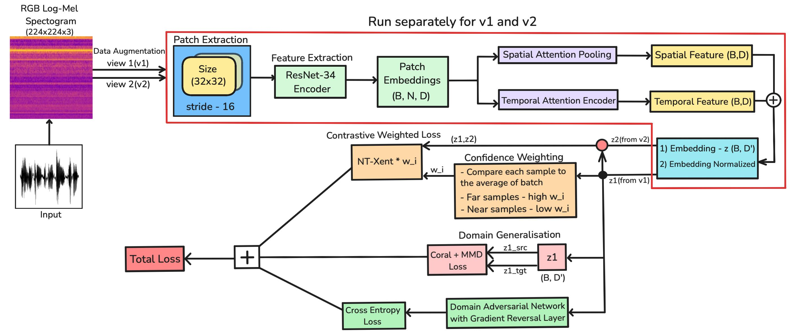
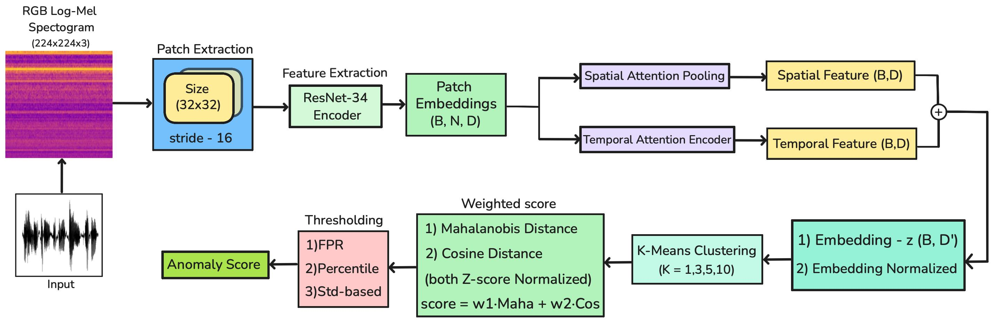
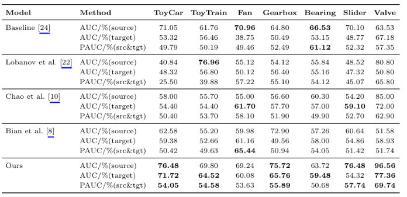

# From Patches to Confidence

### A Dual-Attention and Confidence-Guided Approach for Domain-Adaptive Anomalous Sound Detection

[](https://www.python.org/)
[](https://pytorch.org/)
[](LICENSE)

---

## Overview

This repository contains the implementation of **From Patches to Confidence: A Dual-Attention and Confidence-Guided Approach for Domain-Adaptive Anomalous Sound Detection**.

The proposed approach performs anomalous sound detection using patch-level spatial and temporal representations with confidence-guided learning and domain adaptation.

---

## Architecture

### Training

<div align="center">



</div>

### Inference

<div align="center">



</div>

---

## DCASE 2025 Task 2 Results

<div align="center">



</div>

### Target-Domain Performance

| Machine Type | AUC | pAUC |
|---|---:|---:|
| ToyCar | 71.72 | 54.05 |
| ToyTrain | 64.52 | 54.58 |
| Fan | 60.08 | 53.63 |
| Gearbox | 65.76 | 55.89 |
| Bearing | 59.48 | 50.68 |
| Slider | 54.32 | 57.74 |
| Valve | 77.36 | 69.74 |

---

## Key Components

- Patch-level spatial attention
- Temporal attention
- Confidence-guided contrastive learning
- Domain adaptation
- Multi-centroid anomaly scoring

---

## Dataset

The method is evaluated on the **DCASE Task 2 Anomalous Sound Detection** benchmark across:

- ToyCar
- ToyTrain
- Fan
- Gearbox
- Bearing
- Slider
- Valve

---

## Implementation

- **Backbone:** ResNet-34
- **Input:** 224 × 224 Mel-spectrogram
- **Mel bins:** 128
- **Patch size:** 32 × 32
- **Patch stride:** 16
- **Embedding dimension:** 128
- **Optimizer:** Adam
- **Learning rate:** 2 × 10⁻⁴
- **Batch size:** 96

---

## Repository Structure

```text
From-Patches-to-Confidence/
│
├── assets/
│   ├── train_pipeline.jpeg
│   ├── test_pipeline.jpeg
│   └── dcase2025_results.png
│
├── astra_attn_patch_dataset.py
├── attention_pooling.py
├── convert_rgb.py
├── evaluation4.py
├── evaluation4_k_ablation.py
├── patch_attn_model.py
├── pauc.py
├── train_1.py
├── requirements.txt
├── LICENSE
└── README.md
